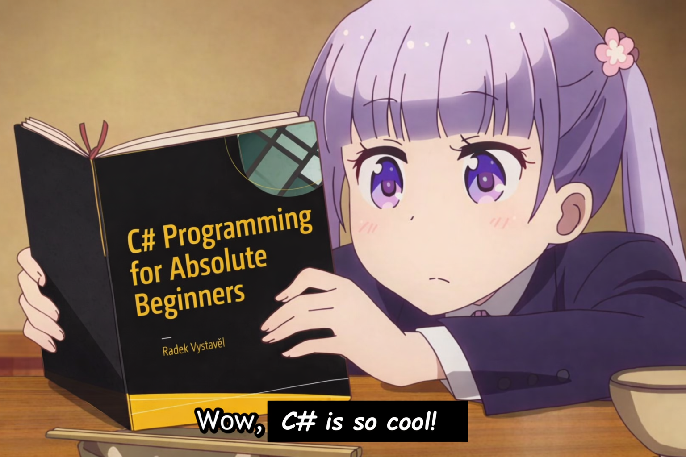

<h1 align="center">Luis Gustavo</h1>

<strong>Software Developer • .NET • C# • React • Azure</strong>

###

<h3 align="center">• About Me</h3>

Exploring game development, Discord bots, IoT, and side projects 
Anime and gaming enthusiast, lifelong learner 

<h4 align="center">Always learning, always building.</h4>

###

<h3 align="center">• Language and tools</h3>

###

  
  
  
  
  
  
  
  
  
  
  
  
  
  
  
  
  
  
  
  
  
  
  
  
  
  
  
  
  

###
